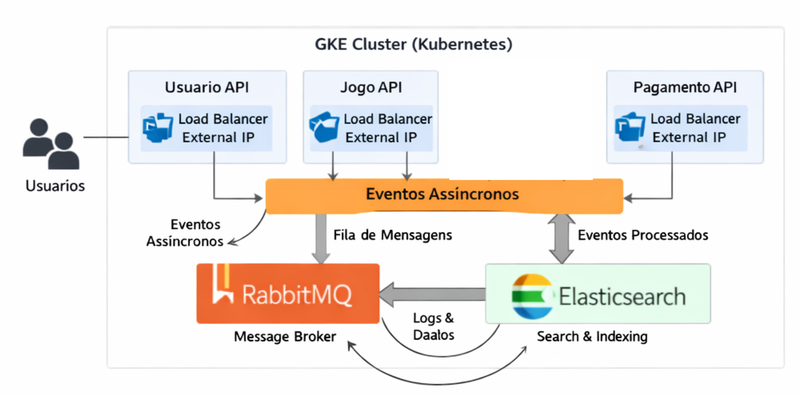
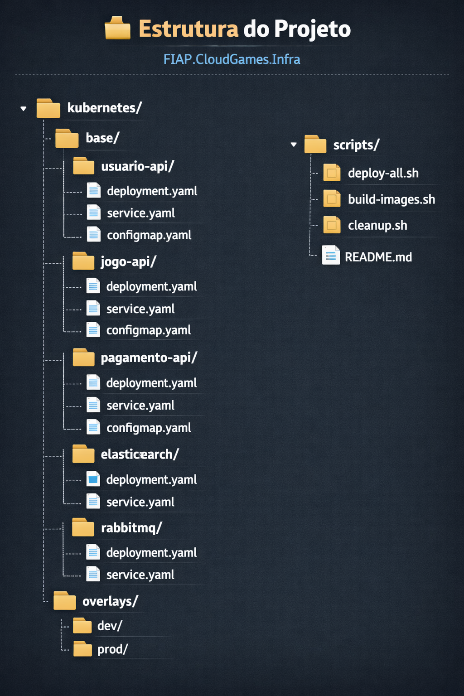

# FIAP CloudGames - Infraestrutura Kubernetes

Repositório de infraestrutura como código (IaC) para orquestração dos microsserviços do projeto FIAP CloudGames no Google Kubernetes Engine (GKE).

---

## 📋 Índice

- [Visão Geral](#visão-geral)
- [Arquitetura](#arquitetura)
- [Microsserviços](#microsserviços)
- [Comunicação Assíncrona](#comunicação-assíncrona)
- [Pré-requisitos](#pré-requisitos)
- [Estrutura do Projeto](#estrutura-do-projeto)
- [Deploy](#deploy)
- [Configuração](#configuração)
- [Monitoramento](#monitoramento)
- [Tecnologias](#tecnologias)

---

## 🎯 Visão Geral

O FIAP CloudGames faz parte do desafio técnico da PÓS TECH em Arquitetura de Sistemas com .NET

### Objetivos do Projeto

- ✅ Orquestração de containers com Kubernetes
- ✅ Comunicação assíncrona entre microsserviços
- ✅ Imagens Docker otimizadas e seguras
- ✅ Monitoramento e observabilidade
- ✅ Auto scaling baseado em métricas

---

## 🏗️ Arquitetura

### Diagrama de Arquitetura Kubernetes

---

## 🔧 Microsserviços

### 1. Usuario API
**Responsabilidade:** Autenticação e gerenciamento de usuários

- **Tecnologia:** .NET 8 (C#)
- **Porta:** 8080
- **Endpoints principais:**
  - `POST /api/v1/usuarios/login` - Autenticação JWT
  - `POST /api/v1/usuarios` - Cadastro de usuários
  - `GET /api/v1/usuarios/{id}` - Consulta de usuário

**Configurações:**
- JWT Issuer: `FIAP.CloudGames.Usuario.API`
- JWT Audience: `FIAP.CloudGames.Client`
- Banco: In-Memory

---

### 2. Jogo API
**Responsabilidade:** CRUD de jogos e busca indexada

- **Tecnologia:** .NET 8 (C#)
- **Porta:** 8080
- **Endpoints principais:**
  - `GET /api/v1/jogos` - Listagem de jogos
  - `POST /api/v1/jogos` - Cadastro de jogo
  - `GET /api/v1/jogos/buscar?termo={termo}` - Busca com Elasticsearch

**Configurações:**
- JWT Issuer: `FIAP.CloudGames.Jogo.API`
- JWT Audience: `FIAP.CloudGames.Client`
- Elasticsearch: `http://elasticsearch-service:9200`
- Banco: In-Memory

---

### 3. Pagamento API
**Responsabilidade:** Processamento de pagamentos

- **Tecnologia:** .NET 8 (C#)
- **Porta:** 8080
- **Endpoints principais:**
  - `POST /api/v1/pagamentos` - Processar pagamento
  - `GET /api/v1/pagamentos/{id}` - Consultar pagamento

**Configurações:**
- JWT Issuer: `FIAP.CloudGames.Pagamento.API`
- JWT Audience: `FIAP.CloudGames.Client`
- Service URLs:
  - Usuario API: `http://34.95.141.115`
  - Jogo API: `http://35.198.10.23`
- Banco: In-Memory

---

## 📡 Comunicação Assíncrona

### Fluxo de Eventos com RabbitMQ
┌─────────────────┐ │ Usuario API │ │ (Autenticação) │ └────────┬────────┘ │ │ Publica evento: UsuarioCriado ▼ ┌────────────┐ │ RabbitMQ │ │ Exchange │ └─────┬──────┘ │ ├──────────────────────┐ │ │ ▼ ▼ ┌──────────┐ ┌──────────────┐ │ Jogo API │ │ Pagamento API│ │ │ │ │ │ Consome: │ │ Consome: │ │ Criar │ │ Criar │ │ Biblioteca│ │ Carteira │ └──────────┘ └──────────────┘

### Eventos Implementados

#### 1. UsuarioCriado
**Publisher:** Usuario API  
**Consumers:** Jogo API, Pagamento API

**Payload:**

json
Copiar

<pre id="code-zcfboh3i8" style="color:white;font-family:Consolas, Monaco, &quot;Andale Mono&quot;, &quot;Ubuntu Mono&quot;, monospace;text-align:left;white-space:pre;word-spacing:normal;word-break:normal;word-wrap:normal;line-height:1.5;font-size:1em;-moz-tab-size:4;-o-tab-size:4;tab-size:4;-webkit-hyphens:none;-moz-hyphens:none;-ms-hyphens:none;hyphens:none;padding:8px;margin:8px;overflow:auto;background:#011627;width:calc(100% - 8px);border-radius:8px;box-shadow:0px 8px 18px 0px rgba(120, 120, 143, 0.10), 2px 2px 10px 0px rgba(255, 255, 255, 0.30) inset"><code class="language-json" style="white-space:pre;color:#d6deeb;font-family:Consolas, Monaco, &quot;Andale Mono&quot;, &quot;Ubuntu Mono&quot;, monospace;text-align:left;word-spacing:normal;word-break:normal;word-wrap:normal;line-height:1.5;font-size:1em;-moz-tab-size:4;-o-tab-size:4;tab-size:4;-webkit-hyphens:none;-moz-hyphens:none;-ms-hyphens:none;hyphens:none">{
  &quot;usuarioId&quot;: 1,
  &quot;email&quot;: &quot;usuario@exemplo.com&quot;,
  &quot;dataCriacao&quot;: &quot;2026-01-13T00:00:00Z&quot;
}
</code></pre>

**Ações:**
- **Jogo API:** Cria biblioteca de jogos vazia para o usuário
- **Pagamento API:** Cria carteira digital com saldo zero

---

#### 2. PagamentoProcessado
**Publisher:** Pagamento API  
**Consumers:** Jogo API, Usuario API

**Payload:**

json
Copiar

<pre id="code-i82ujm05u" style="color:white;font-family:Consolas, Monaco, &quot;Andale Mono&quot;, &quot;Ubuntu Mono&quot;, monospace;text-align:left;white-space:pre;word-spacing:normal;word-break:normal;word-wrap:normal;line-height:1.5;font-size:1em;-moz-tab-size:4;-o-tab-size:4;tab-size:4;-webkit-hyphens:none;-moz-hyphens:none;-ms-hyphens:none;hyphens:none;padding:8px;margin:8px;overflow:auto;background:#011627;width:calc(100% - 8px);border-radius:8px;box-shadow:0px 8px 18px 0px rgba(120, 120, 143, 0.10), 2px 2px 10px 0px rgba(255, 255, 255, 0.30) inset"><code class="language-json" style="white-space:pre;color:#d6deeb;font-family:Consolas, Monaco, &quot;Andale Mono&quot;, &quot;Ubuntu Mono&quot;, monospace;text-align:left;word-spacing:normal;word-break:normal;word-wrap:normal;line-height:1.5;font-size:1em;-moz-tab-size:4;-o-tab-size:4;tab-size:4;-webkit-hyphens:none;-moz-hyphens:none;-ms-hyphens:none;hyphens:none">{
  &quot;pagamentoId&quot;: 123,
  &quot;usuarioId&quot;: 1,
  &quot;jogoId&quot;: 5,
  &quot;valor&quot;: 59.90,
  &quot;status&quot;: &quot;Aprovado&quot;,
  &quot;dataProcessamento&quot;: &quot;2026-01-13T02:00:00Z&quot;
}
</code></pre>

**Ações:**
- **Jogo API:** Adiciona jogo à biblioteca do usuário
- **Usuario API:** Registra histórico de compras

---

#### 3. JogoAdicionado
**Publisher:** Jogo API  
**Consumers:** Elasticsearch (indexação)

**Payload:**

json
Copiar

<pre id="code-e5l0p39r1" style="color:white;font-family:Consolas, Monaco, &quot;Andale Mono&quot;, &quot;Ubuntu Mono&quot;, monospace;text-align:left;white-space:pre;word-spacing:normal;word-break:normal;word-wrap:normal;line-height:1.5;font-size:1em;-moz-tab-size:4;-o-tab-size:4;tab-size:4;-webkit-hyphens:none;-moz-hyphens:none;-ms-hyphens:none;hyphens:none;padding:8px;margin:8px;overflow:auto;background:#011627;width:calc(100% - 8px);border-radius:8px;box-shadow:0px 8px 18px 0px rgba(120, 120, 143, 0.10), 2px 2px 10px 0px rgba(255, 255, 255, 0.30) inset"><code class="language-json" style="white-space:pre;color:#d6deeb;font-family:Consolas, Monaco, &quot;Andale Mono&quot;, &quot;Ubuntu Mono&quot;, monospace;text-align:left;word-spacing:normal;word-break:normal;word-wrap:normal;line-height:1.5;font-size:1em;-moz-tab-size:4;-o-tab-size:4;tab-size:4;-webkit-hyphens:none;-moz-hyphens:none;-ms-hyphens:none;hyphens:none">{
  &quot;jogoId&quot;: 5,
  &quot;nome&quot;: &quot;FIFA 24&quot;,
  &quot;descricao&quot;: &quot;Simulador de futebol&quot;,
  &quot;preco&quot;: 299.90,
  &quot;tags&quot;: [&quot;esporte&quot;, &quot;multiplayer&quot;]
}
</code></pre>

**Ações:**
- **Elasticsearch:** Indexa jogo para busca rápida

---

### Configuração RabbitMQ

**Exchanges:**
- `fiap.cloudgames.usuarios` (tipo: fanout)
- `fiap.cloudgames.pagamentos` (tipo: fanout)
- `fiap.cloudgames.jogos` (tipo: topic)

**Queues:**
- `usuario.criado.jogo-api`
- `usuario.criado.pagamento-api`
- `pagamento.processado.jogo-api`
- `jogo.adicionado.elasticsearch`

**Dead Letter Queue:**
- `dlq.fiap.cloudgames` (retry após 3 tentativas)

---

## 📦 Pré-requisitos

- **Google Cloud Account** com billing ativo
- **gcloud CLI** instalado e configurado
- **kubectl** instalado
- **Docker** (para build local, opcional)
- **Git** para versionamento

---

## 📂 Estrutura de Arquivos do Projeto de Infra

---

## 🚀 Deploy

### 1. Criar Cluster GKE

bash
Copiar

<pre id="code-9rmxbm9va" style="color:white;font-family:Consolas, Monaco, &quot;Andale Mono&quot;, &quot;Ubuntu Mono&quot;, monospace;text-align:left;white-space:pre;word-spacing:normal;word-break:normal;word-wrap:normal;line-height:1.5;font-size:1em;-moz-tab-size:4;-o-tab-size:4;tab-size:4;-webkit-hyphens:none;-moz-hyphens:none;-ms-hyphens:none;hyphens:none;padding:8px;margin:8px;overflow:auto;background:#011627;width:calc(100% - 8px);border-radius:8px;box-shadow:0px 8px 18px 0px rgba(120, 120, 143, 0.10), 2px 2px 10px 0px rgba(255, 255, 255, 0.30) inset"><code class="language-bash" style="white-space:pre;color:#d6deeb;font-family:Consolas, Monaco, &quot;Andale Mono&quot;, &quot;Ubuntu Mono&quot;, monospace;text-align:left;word-spacing:normal;word-break:normal;word-wrap:normal;line-height:1.5;font-size:1em;-moz-tab-size:4;-o-tab-size:4;tab-size:4;-webkit-hyphens:none;-moz-hyphens:none;-ms-hyphens:none;hyphens:none">gcloud container clusters create fiap-cloudgames-cluster \
  --zone=southamerica-east1-a \
  --num-nodes=3 \
  --machine-type=e2-medium \
  --enable-autoscaling \
  --min-nodes=2 \
  --max-nodes=5
</code></pre>

### 2. Configurar kubectl

bash
Copiar

<pre id="code-yqbtt49dg" style="color:white;font-family:Consolas, Monaco, &quot;Andale Mono&quot;, &quot;Ubuntu Mono&quot;, monospace;text-align:left;white-space:pre;word-spacing:normal;word-break:normal;word-wrap:normal;line-height:1.5;font-size:1em;-moz-tab-size:4;-o-tab-size:4;tab-size:4;-webkit-hyphens:none;-moz-hyphens:none;-ms-hyphens:none;hyphens:none;padding:8px;margin:8px;overflow:auto;background:#011627;width:calc(100% - 8px);border-radius:8px;box-shadow:0px 8px 18px 0px rgba(120, 120, 143, 0.10), 2px 2px 10px 0px rgba(255, 255, 255, 0.30) inset"><code class="language-bash" style="white-space:pre;color:#d6deeb;font-family:Consolas, Monaco, &quot;Andale Mono&quot;, &quot;Ubuntu Mono&quot;, monospace;text-align:left;word-spacing:normal;word-break:normal;word-wrap:normal;line-height:1.5;font-size:1em;-moz-tab-size:4;-o-tab-size:4;tab-size:4;-webkit-hyphens:none;-moz-hyphens:none;-ms-hyphens:none;hyphens:none">gcloud container clusters get-credentials fiap-cloudgames-cluster \
  --zone=southamerica-east1-a
</code></pre>

### 3. Deploy de Infraestrutura

bash
Copiar

<pre id="code-7b5rd9z8w" style="color:white;font-family:Consolas, Monaco, &quot;Andale Mono&quot;, &quot;Ubuntu Mono&quot;, monospace;text-align:left;white-space:pre;word-spacing:normal;word-break:normal;word-wrap:normal;line-height:1.5;font-size:1em;-moz-tab-size:4;-o-tab-size:4;tab-size:4;-webkit-hyphens:none;-moz-hyphens:none;-ms-hyphens:none;hyphens:none;padding:8px;margin:8px;overflow:auto;background:#011627;width:calc(100% - 8px);border-radius:8px;box-shadow:0px 8px 18px 0px rgba(120, 120, 143, 0.10), 2px 2px 10px 0px rgba(255, 255, 255, 0.30) inset"><code class="language-bash" style="white-space:pre;color:#d6deeb;font-family:Consolas, Monaco, &quot;Andale Mono&quot;, &quot;Ubuntu Mono&quot;, monospace;text-align:left;word-spacing:normal;word-break:normal;word-wrap:normal;line-height:1.5;font-size:1em;-moz-tab-size:4;-o-tab-size:4;tab-size:4;-webkit-hyphens:none;-moz-hyphens:none;-ms-hyphens:none;hyphens:none"># Elasticsearch
kubectl apply -f kubernetes/base/elasticsearch/

# RabbitMQ
kubectl apply -f kubernetes/base/rabbitmq/
</code></pre>

### 4. Deploy das APIs

bash
Copiar

<pre id="code-n8lgcn866" style="color:white;font-family:Consolas, Monaco, &quot;Andale Mono&quot;, &quot;Ubuntu Mono&quot;, monospace;text-align:left;white-space:pre;word-spacing:normal;word-break:normal;word-wrap:normal;line-height:1.5;font-size:1em;-moz-tab-size:4;-o-tab-size:4;tab-size:4;-webkit-hyphens:none;-moz-hyphens:none;-ms-hyphens:none;hyphens:none;padding:8px;margin:8px;overflow:auto;background:#011627;width:calc(100% - 8px);border-radius:8px;box-shadow:0px 8px 18px 0px rgba(120, 120, 143, 0.10), 2px 2px 10px 0px rgba(255, 255, 255, 0.30) inset"><code class="language-bash" style="white-space:pre;color:#d6deeb;font-family:Consolas, Monaco, &quot;Andale Mono&quot;, &quot;Ubuntu Mono&quot;, monospace;text-align:left;word-spacing:normal;word-break:normal;word-wrap:normal;line-height:1.5;font-size:1em;-moz-tab-size:4;-o-tab-size:4;tab-size:4;-webkit-hyphens:none;-moz-hyphens:none;-ms-hyphens:none;hyphens:none"># Usuario API
kubectl apply -f kubernetes/base/usuario-api/

# Jogo API
kubectl apply -f kubernetes/base/jogo-api/

# Pagamento API
kubectl apply -f kubernetes/base/pagamento-api/
</code></pre>

### 5. Verificar Deploy

bash
Copiar

<pre id="code-97d6c3242" style="color:white;font-family:Consolas, Monaco, &quot;Andale Mono&quot;, &quot;Ubuntu Mono&quot;, monospace;text-align:left;white-space:pre;word-spacing:normal;word-break:normal;word-wrap:normal;line-height:1.5;font-size:1em;-moz-tab-size:4;-o-tab-size:4;tab-size:4;-webkit-hyphens:none;-moz-hyphens:none;-ms-hyphens:none;hyphens:none;padding:8px;margin:8px;overflow:auto;background:#011627;width:calc(100% - 8px);border-radius:8px;box-shadow:0px 8px 18px 0px rgba(120, 120, 143, 0.10), 2px 2px 10px 0px rgba(255, 255, 255, 0.30) inset"><code class="language-bash" style="white-space:pre;color:#d6deeb;font-family:Consolas, Monaco, &quot;Andale Mono&quot;, &quot;Ubuntu Mono&quot;, monospace;text-align:left;word-spacing:normal;word-break:normal;word-wrap:normal;line-height:1.5;font-size:1em;-moz-tab-size:4;-o-tab-size:4;tab-size:4;-webkit-hyphens:none;-moz-hyphens:none;-ms-hyphens:none;hyphens:none"># Pods
kubectl get pods
<!-- -->
# Services
kubectl get services
<!-- -->
# IPs Externos
kubectl get services | grep LoadBalancer
</code></pre>

---

## ⚙️ Configuração

### ConfigMaps

Cada API possui um ConfigMap com `appsettings.json`:

**Exemplo: usuario-api-config**

yaml
Copiar

<pre id="code-plws8weyo" style="color:white;font-family:Consolas, Monaco, &quot;Andale Mono&quot;, &quot;Ubuntu Mono&quot;, monospace;text-align:left;white-space:pre;word-spacing:normal;word-break:normal;word-wrap:normal;line-height:1.5;font-size:1em;-moz-tab-size:4;-o-tab-size:4;tab-size:4;-webkit-hyphens:none;-moz-hyphens:none;-ms-hyphens:none;hyphens:none;padding:8px;margin:8px;overflow:auto;background:#011627;width:calc(100% - 8px);border-radius:8px;box-shadow:0px 8px 18px 0px rgba(120, 120, 143, 0.10), 2px 2px 10px 0px rgba(255, 255, 255, 0.30) inset"><code class="language-yaml" style="white-space:pre;color:#d6deeb;font-family:Consolas, Monaco, &quot;Andale Mono&quot;, &quot;Ubuntu Mono&quot;, monospace;text-align:left;word-spacing:normal;word-break:normal;word-wrap:normal;line-height:1.5;font-size:1em;-moz-tab-size:4;-o-tab-size:4;tab-size:4;-webkit-hyphens:none;-moz-hyphens:none;-ms-hyphens:none;hyphens:none">apiVersion: v1
kind: ConfigMap
metadata:
  name: usuario-api-config
data:
  appsettings.json: |
    {
      &quot;Jwt&quot;: {
        &quot;Key&quot;: &quot;FIAP_CloudGames_Secret_Key_2024_Min_32_Chars_Long&quot;,
        &quot;Issuer&quot;: &quot;FIAP.CloudGames.Usuario.API&quot;,
        &quot;Audience&quot;: &quot;FIAP.CloudGames.Client&quot;,
        &quot;ExpirationInMinutes&quot;: 60
      },
      &quot;ConnectionStrings&quot;: {
        &quot;DefaultConnection&quot;: &quot;InMemory&quot;
      }
    }
</code></pre>

### Sincronização de Chaves JWT

**Chaves utilizadas:**
- **Usuario API:** `FIAP_CloudGames_Secret_Key_2024_Min_32_Chars_Long`
- **Jogo API:** `FIAP_CloudGames_Jogo_Secret_Key_2024_Min_32_Chars_Long`
- **Pagamento API:** Valida tokens com `IssuersKeys` das outras APIs

---

## 📊 Monitoramento

### Elasticsearch

**Acesso interno:**

bash
Copiar

<pre id="code-i7hundbzn" style="color:white;font-family:Consolas, Monaco, &quot;Andale Mono&quot;, &quot;Ubuntu Mono&quot;, monospace;text-align:left;white-space:pre;word-spacing:normal;word-break:normal;word-wrap:normal;line-height:1.5;font-size:1em;-moz-tab-size:4;-o-tab-size:4;tab-size:4;-webkit-hyphens:none;-moz-hyphens:none;-ms-hyphens:none;hyphens:none;padding:8px;margin:8px;overflow:auto;background:#011627;width:calc(100% - 8px);border-radius:8px;box-shadow:0px 8px 18px 0px rgba(120, 120, 143, 0.10), 2px 2px 10px 0px rgba(255, 255, 255, 0.30) inset"><code class="language-bash" style="white-space:pre;color:#d6deeb;font-family:Consolas, Monaco, &quot;Andale Mono&quot;, &quot;Ubuntu Mono&quot;, monospace;text-align:left;word-spacing:normal;word-break:normal;word-wrap:normal;line-height:1.5;font-size:1em;-moz-tab-size:4;-o-tab-size:4;tab-size:4;-webkit-hyphens:none;-moz-hyphens:none;-ms-hyphens:none;hyphens:none">kubectl port-forward service/elasticsearch-service 9200:9200
</code></pre>

**Health Check:**

bash
Copiar

<pre id="code-t2xrqfgza" style="color:white;font-family:Consolas, Monaco, &quot;Andale Mono&quot;, &quot;Ubuntu Mono&quot;, monospace;text-align:left;white-space:pre;word-spacing:normal;word-break:normal;word-wrap:normal;line-height:1.5;font-size:1em;-moz-tab-size:4;-o-tab-size:4;tab-size:4;-webkit-hyphens:none;-moz-hyphens:none;-ms-hyphens:none;hyphens:none;padding:8px;margin:8px;overflow:auto;background:#011627;width:calc(100% - 8px);border-radius:8px;box-shadow:0px 8px 18px 0px rgba(120, 120, 143, 0.10), 2px 2px 10px 0px rgba(255, 255, 255, 0.30) inset"><code class="language-bash" style="white-space:pre;color:#d6deeb;font-family:Consolas, Monaco, &quot;Andale Mono&quot;, &quot;Ubuntu Mono&quot;, monospace;text-align:left;word-spacing:normal;word-break:normal;word-wrap:normal;line-height:1.5;font-size:1em;-moz-tab-size:4;-o-tab-size:4;tab-size:4;-webkit-hyphens:none;-moz-hyphens:none;-ms-hyphens:none;hyphens:none">curl http://localhost:9200/_cluster/health
</code></pre>

### Logs de Pods

bash
Copiar

<pre id="code-qp9coubfg" style="color:white;font-family:Consolas, Monaco, &quot;Andale Mono&quot;, &quot;Ubuntu Mono&quot;, monospace;text-align:left;white-space:pre;word-spacing:normal;word-break:normal;word-wrap:normal;line-height:1.5;font-size:1em;-moz-tab-size:4;-o-tab-size:4;tab-size:4;-webkit-hyphens:none;-moz-hyphens:none;-ms-hyphens:none;hyphens:none;padding:8px;margin:8px;overflow:auto;background:#011627;width:calc(100% - 8px);border-radius:8px;box-shadow:0px 8px 18px 0px rgba(120, 120, 143, 0.10), 2px 2px 10px 0px rgba(255, 255, 255, 0.30) inset"><code class="language-bash" style="white-space:pre;color:#d6deeb;font-family:Consolas, Monaco, &quot;Andale Mono&quot;, &quot;Ubuntu Mono&quot;, monospace;text-align:left;word-spacing:normal;word-break:normal;word-wrap:normal;line-height:1.5;font-size:1em;-moz-tab-size:4;-o-tab-size:4;tab-size:4;-webkit-hyphens:none;-moz-hyphens:none;-ms-hyphens:none;hyphens:none"># Logs em tempo real
kubectl logs -f &lt;pod-name&gt;

# Últimas 100 linhas
kubectl logs --tail=100 &lt;pod-name&gt;
</code></pre>

### Métricas do Cluster

bash
Copiar

<pre id="code-svn5fa9h7" style="color:white;font-family:Consolas, Monaco, &quot;Andale Mono&quot;, &quot;Ubuntu Mono&quot;, monospace;text-align:left;white-space:pre;word-spacing:normal;word-break:normal;word-wrap:normal;line-height:1.5;font-size:1em;-moz-tab-size:4;-o-tab-size:4;tab-size:4;-webkit-hyphens:none;-moz-hyphens:none;-ms-hyphens:none;hyphens:none;padding:8px;margin:8px;overflow:auto;background:#011627;width:calc(100% - 8px);border-radius:8px;box-shadow:0px 8px 18px 0px rgba(120, 120, 143, 0.10), 2px 2px 10px 0px rgba(255, 255, 255, 0.30) inset"><code class="language-bash" style="white-space:pre;color:#d6deeb;font-family:Consolas, Monaco, &quot;Andale Mono&quot;, &quot;Ubuntu Mono&quot;, monospace;text-align:left;word-spacing:normal;word-break:normal;word-wrap:normal;line-height:1.5;font-size:1em;-moz-tab-size:4;-o-tab-size:4;tab-size:4;-webkit-hyphens:none;-moz-hyphens:none;-ms-hyphens:none;hyphens:none">kubectl top nodes
kubectl top pods
</code></pre>

---

## 🛠️ Tecnologias

### Backend
- **.NET 8** - Framework principal
- **C#** - Linguagem de programação
- **Entity Framework Core** - ORM (In-Memory)
- **JWT Bearer** - Autenticação

### Infraestrutura
- **Google Kubernetes Engine (GKE)** - Orquestração
- **Google Artifact Registry** - Registro de imagens
- **Docker** - Containerização
- **Elasticsearch** - Busca e logs
- **RabbitMQ** - Mensageria assíncrona

### DevOps
- **kubectl** - CLI Kubernetes
- **gcloud** - CLI Google Cloud
- **Cloud Shell** - Ambiente de desenvolvimento

---

## 🐳 Docker

### Imagens Otimizadas

**Características:**
- **Multi-stage build** (build + runtime separados)
- **Base image:** `mcr.microsoft.com/dotnet/aspnet:8.0-alpine`
- **Tamanho:** ~200MB (vs ~500MB padrão)
- **Segurança:** Imagens Alpine com menos vulnerabilidades

**Exemplo Dockerfile:**

dockerfile
Copiar

<pre id="code-crbqfxnfd" style="color:white;font-family:Consolas, Monaco, &quot;Andale Mono&quot;, &quot;Ubuntu Mono&quot;, monospace;text-align:left;white-space:pre;word-spacing:normal;word-break:normal;word-wrap:normal;line-height:1.5;font-size:1em;-moz-tab-size:4;-o-tab-size:4;tab-size:4;-webkit-hyphens:none;-moz-hyphens:none;-ms-hyphens:none;hyphens:none;padding:8px;margin:8px;overflow:auto;background:#011627;width:calc(100% - 8px);border-radius:8px;box-shadow:0px 8px 18px 0px rgba(120, 120, 143, 0.10), 2px 2px 10px 0px rgba(255, 255, 255, 0.30) inset"><code class="language-dockerfile" style="white-space:pre;color:#d6deeb;font-family:Consolas, Monaco, &quot;Andale Mono&quot;, &quot;Ubuntu Mono&quot;, monospace;text-align:left;word-spacing:normal;word-break:normal;word-wrap:normal;line-height:1.5;font-size:1em;-moz-tab-size:4;-o-tab-size:4;tab-size:4;-webkit-hyphens:none;-moz-hyphens:none;-ms-hyphens:none;hyphens:none">FROM mcr.microsoft.com/dotnet/sdk:8.0 AS build
WORKDIR /src
COPY . .
RUN dotnet restore
RUN dotnet publish -c Release -o /app/publish

FROM mcr.microsoft.com/dotnet/aspnet:8.0-alpine
WORKDIR /app
COPY --from=build /app/publish .
EXPOSE 8080
ENTRYPOINT [&quot;dotnet&quot;, &quot;FIAP.CloudGames.Usuario.API.dll&quot;]
</code></pre>

---

## 📝 Comandos Úteis

### Deploy

bash
Copiar

<pre id="code-3otq9kv91" style="color:white;font-family:Consolas, Monaco, &quot;Andale Mono&quot;, &quot;Ubuntu Mono&quot;, monospace;text-align:left;white-space:pre;word-spacing:normal;word-break:normal;word-wrap:normal;line-height:1.5;font-size:1em;-moz-tab-size:4;-o-tab-size:4;tab-size:4;-webkit-hyphens:none;-moz-hyphens:none;-ms-hyphens:none;hyphens:none;padding:8px;margin:8px;overflow:auto;background:#011627;width:calc(100% - 8px);border-radius:8px;box-shadow:0px 8px 18px 0px rgba(120, 120, 143, 0.10), 2px 2px 10px 0px rgba(255, 255, 255, 0.30) inset"><code class="language-bash" style="white-space:pre;color:#d6deeb;font-family:Consolas, Monaco, &quot;Andale Mono&quot;, &quot;Ubuntu Mono&quot;, monospace;text-align:left;word-spacing:normal;word-break:normal;word-wrap:normal;line-height:1.5;font-size:1em;-moz-tab-size:4;-o-tab-size:4;tab-size:4;-webkit-hyphens:none;-moz-hyphens:none;-ms-hyphens:none;hyphens:none"># Aplicar todos os manifestos
kubectl apply -f kubernetes/base/

# Reiniciar deployment
kubectl rollout restart deployment/&lt;deployment-name&gt;

# Verificar status do rollout
kubectl rollout status deployment/&lt;deployment-name&gt;
</code></pre>

### Debug

bash
Copiar

<pre id="code-p55122sa9" style="color:white;font-family:Consolas, Monaco, &quot;Andale Mono&quot;, &quot;Ubuntu Mono&quot;, monospace;text-align:left;white-space:pre;word-spacing:normal;word-break:normal;word-wrap:normal;line-height:1.5;font-size:1em;-moz-tab-size:4;-o-tab-size:4;tab-size:4;-webkit-hyphens:none;-moz-hyphens:none;-ms-hyphens:none;hyphens:none;padding:8px;margin:8px;overflow:auto;background:#011627;width:calc(100% - 8px);border-radius:8px;box-shadow:0px 8px 18px 0px rgba(120, 120, 143, 0.10), 2px 2px 10px 0px rgba(255, 255, 255, 0.30) inset"><code class="language-bash" style="white-space:pre;color:#d6deeb;font-family:Consolas, Monaco, &quot;Andale Mono&quot;, &quot;Ubuntu Mono&quot;, monospace;text-align:left;word-spacing:normal;word-break:normal;word-wrap:normal;line-height:1.5;font-size:1em;-moz-tab-size:4;-o-tab-size:4;tab-size:4;-webkit-hyphens:none;-moz-hyphens:none;-ms-hyphens:none;hyphens:none"># Descrever pod
kubectl describe pod &lt;pod-name&gt;

# Executar comando no pod
kubectl exec -it &lt;pod-name&gt; -- /bin/sh

# Port forward
kubectl port-forward service/&lt;service-name&gt; 8080:80
</code></pre>

### Limpeza

bash
Copiar

<pre id="code-bt4t8502s" style="color:white;font-family:Consolas, Monaco, &quot;Andale Mono&quot;, &quot;Ubuntu Mono&quot;, monospace;text-align:left;white-space:pre;word-spacing:normal;word-break:normal;word-wrap:normal;line-height:1.5;font-size:1em;-moz-tab-size:4;-o-tab-size:4;tab-size:4;-webkit-hyphens:none;-moz-hyphens:none;-ms-hyphens:none;hyphens:none;padding:8px;margin:8px;overflow:auto;background:#011627;width:calc(100% - 8px);border-radius:8px;box-shadow:0px 8px 18px 0px rgba(120, 120, 143, 0.10), 2px 2px 10px 0px rgba(255, 255, 255, 0.30) inset"><code class="language-bash" style="white-space:pre;color:#d6deeb;font-family:Consolas, Monaco, &quot;Andale Mono&quot;, &quot;Ubuntu Mono&quot;, monospace;text-align:left;word-spacing:normal;word-break:normal;word-wrap:normal;line-height:1.5;font-size:1em;-moz-tab-size:4;-o-tab-size:4;tab-size:4;-webkit-hyphens:none;-moz-hyphens:none;-ms-hyphens:none;hyphens:none"># Deletar todos os recursos
kubectl delete -f kubernetes/base/

# Deletar cluster
gcloud container clusters delete fiap-cloudgames-cluster \
  --zone=southamerica-east1-a
</code></pre>

---

## 🔗 Links Úteis

- **Repositórios:**
  - [Usuario API](https://github.com/ivisconfessor/FIAP.CloudGames.Usuario.API)
  - [Jogo API](https://github.com/ivisconfessor/FIAP.CloudGames.Jogo.API)
  - [Pagamento API](https://github.com/ivisconfessor/FIAP.CloudGames.Pagamento.API)

- **Documentação:**
  - [Kubernetes](https://kubernetes.io/docs/)
  - [Google Cloud](https://cloud.google.com/docs)
  - [.NET 8](https://learn.microsoft.com/dotnet/)

---

## 👥 Equipe

- **Nome do Grupo:** Grupo 107
- **Participantes:**
  - Discord: @ivisconfessor

---

## 📄 Licença

Este projeto foi desenvolvido como parte do Tech Challenge - Fase 4 da FIAP.

---
